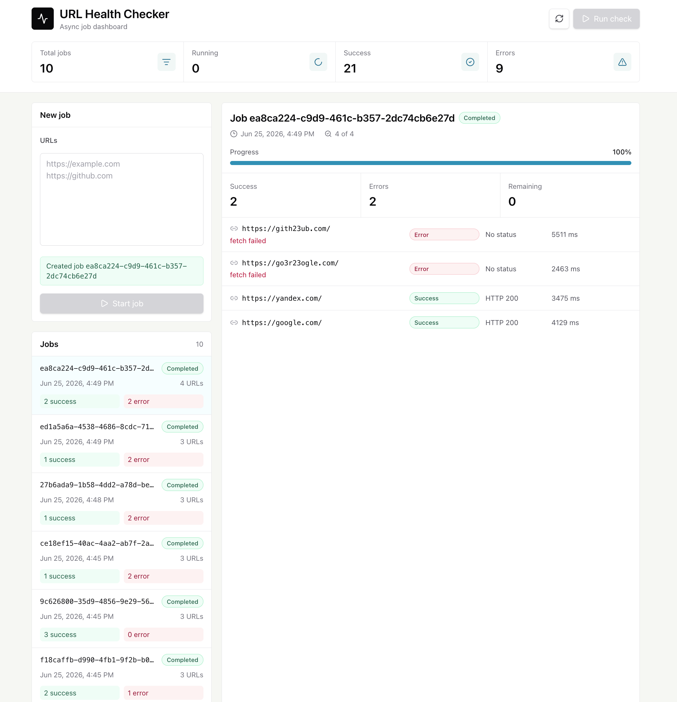
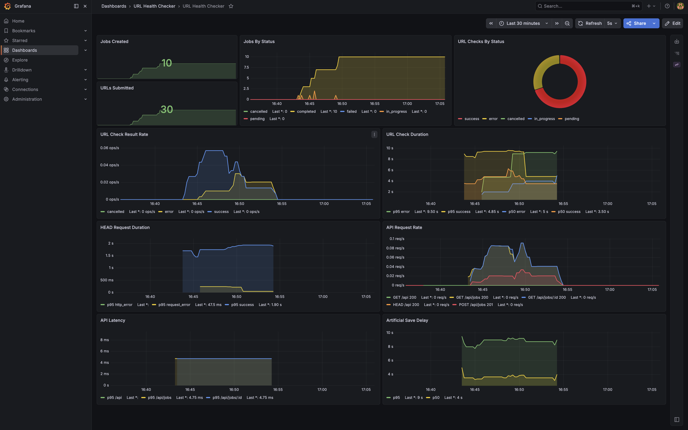
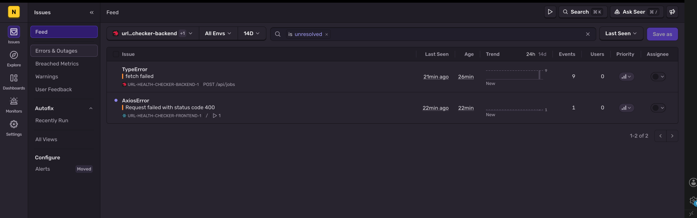

# URL Health Checker

Fullstack app for asynchronous URL checks.

You paste a list of URLs, create a job, and the backend checks every URL in the background with HTTP `HEAD` requests. The frontend shows the job list, live progress, per-URL results, HTTP status codes, errors, and allows cancelling a running job.

The project is intentionally small, but it has the things I would expect from a real service: API docs, Docker setup, metrics, a Grafana dashboard, and Sentry for error monitoring.

## What It Can Do

- Create a job from a list of URLs.
- Process URL checks asynchronously in the background.
- Limit concurrent URL checks per job.
- Show all jobs with status and success/error stats.
- Show detailed status for every URL in a job.
- Cancel a job and skip URLs that have not started yet.
- Expose Swagger docs for the API.
- Expose Prometheus metrics.
- Show a ready-to-use Grafana dashboard.
- Send backend and frontend errors to Sentry.

Data is stored in memory, so jobs are reset after the backend restarts.

## Screenshots

### Frontend



### Grafana



### Sentry



## Tech Stack

- Backend: NestJS, Fastify, TypeScript
- Frontend: React, TypeScript, Vite, Tailwind CSS, Zustand
- API client: Axios
- Observability: Prometheus, Grafana, Sentry
- Runtime: Docker and Docker Compose

## Run With Docker

The easiest way to run the whole project is Docker Compose.

```bash
docker compose up --build
```

After startup:

| Service | URL |
| --- | --- |
| Frontend | http://localhost:5173 |
| Backend API | http://localhost:3000/api |
| Swagger | http://localhost:3000/api/docs |
| Backend metrics | http://localhost:3000/api/metrics |
| Prometheus | http://localhost:9090 |
| Grafana | http://localhost:3002 |
| Grafana dashboard | http://localhost:3002/d/url-health-checker/url-health-checker?orgId=1 |

Grafana credentials:

```text
admin / admin
```

To stop everything:

```bash
docker compose down
```

## Environment

Sentry is optional. The app works without it.

If you want to enable Sentry locally, copy the example file and add your own DSNs:

```bash
cp .env.example .env
```

Useful variables:

```text
SENTRY_DSN=
VITE_SENTRY_DSN=
JOB_URL_CONCURRENCY_LIMIT=5
```

`SENTRY_DSN` is used by the backend, `VITE_SENTRY_DSN` is used by the frontend.

## Manual Run

If you want to run the apps without Docker, start the backend and frontend in separate terminals.

Backend:

```bash
cd backend
npm install
npm run start:dev
```

The backend will run on:

```text
http://localhost:3000
```

Frontend:

```bash
cd frontend
npm install
npm run dev
```

The frontend will run on:

```text
http://localhost:5173
```

In development mode, Vite proxies `/api` requests to the backend.

## API

| Method | Endpoint | Description |
| --- | --- | --- |
| `POST` | `/api/jobs` | Create a new URL check job |
| `GET` | `/api/jobs` | Get recent jobs with short stats |
| `GET` | `/api/jobs/:id` | Get full job details |
| `DELETE` | `/api/jobs/:id` | Cancel a job |
| `GET` | `/api/metrics` | Prometheus metrics |

Create job example:

```json
{
  "urls": [
    "https://example.com",
    "https://github.com"
  ]
}
```

Response:

```json
{
  "jobId": "..."
}
```

## How URL Checks Work

For each URL the backend sends an HTTP `HEAD` request.

Before saving the result, it waits for a random delay from 0 to 10 seconds. This makes the async job flow visible in the UI.

Each job has its own concurrency limit. By default, up to 5 URL checks can run at the same time for one job.

## Observability

Prometheus scrapes backend metrics from:

```text
http://localhost:3000/api/metrics
```

Grafana starts with a preconfigured dashboard:

```text
http://localhost:3002/d/url-health-checker/url-health-checker?orgId=1
```

The dashboard shows job counters, URL check results, request latency, processing time, and API metrics.

Sentry is connected separately for backend and frontend. It is useful for checking real errors, stack traces, request context, and where the issue happened.

The most useful Sentry page for this project is:

```text
Issues -> Feed
```

## Tests

Backend:

```bash
cd backend
npm test
npm run test:e2e
```

Frontend:

```bash
cd frontend
npm run lint
npm run build
```

## Project Structure

```text
backend/        NestJS API and background job processing
frontend/       React app
observability/  Prometheus and Grafana config
docs/           Screenshots for README
```
